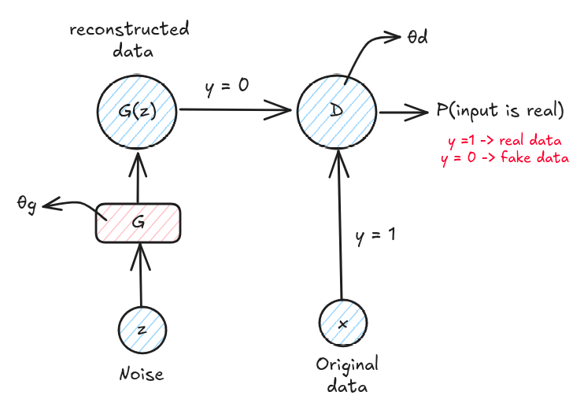

# GAN description

A GAN is a combination of two model, the first one is called Discriminator (represented by $P(Y|X=x)$) wich determinates if the generated data is **real or fake** and a Generator wich generates new **instances** of data (represented by $P(Y|X)P(X)$).

  

The image shows a GAN at a high level representation, $z$ represents a random normal noise distribution, this noise goes to the Generator creating $G(z)$ ($\theta_g$ represents the **weights of the Genereator**) wich is the new instance of data generated (wich is $y=0$ because is fake data). Then, this reconstructed data goes to the Discriminator + One sample of original data $x$ ($\theta_d$ represents the **weights of the Discriminator**). Finally, the Discriminator will return the probability of the input data $G(z)$ being original.

The Discriminator will try to **maximize** the chances of predicting correct classes but the Generator wil try to **fool** the Discriminator, generating a **two player minimax** game in wich one player is trying to maximize his probabilities of winning and the other player is trying to minimize the first player prob. of winning.

## Minimax

### Value function

$$\underset{G}{\text{min}} \ \underset{D}{\text{max}} \ V(G, D)= \Epsilon_{x \sim p_{data}}[ln(D(x))] + \Epsilon_{z \sim p_{data}}[ln(1 - D(G(z)))]$$

To understand this formula i'll do a comparision with the **Binary Crossentropy Function**

$$L = -\sum y * ln(\hat{y})+(1-y)*ln(1-\hat{y})$$

$y$ represents the ground truth and $\hat{y}$ represents the prediction of the model, in this formula we have this two cases:

$$
\begin{cases} 
y = 1, & \hat{y}=D(x) \Rightarrow L = ln[D(x)]\\
y = 0, & \hat{y}=D(G(z)) \Rightarrow L = ln[1 - D(G(z))]
\end{cases}
$$

adding together:
$$
L = ln[D(z)]+ ln[1-D(G(z))] 
$$

This result is very similar with the value function of minimax with the difference that it doesn't have the **expectation terms E**, meaning that this equation is valid for only on data point, but, it has to be valid on all the dataset, for that appears **Expectation**.

#### Expectation

Average value of an experiment if you perform this experiment a long number of times.

$$
E(x) = \sum_ix_if(x_i)
$$

Applying exectation on $L$ derivated from BCEL gives:

$$
E(L) = E(ln[D(z)])+ E(ln[1-D(G(z))])
$$

wich if the distribution of $x$ and $z$ are discrete results in:
$$
\sum p_{data}(x)*ln[D(z)] + \sum p_{z}(z)*ln[1-D(G(z))]
$$

And if they are continous distributions:
$$
\int p_{data}(x)*ln[D(z)] dx + \int p_{z}(z)*ln[1-D(G(z))] dz
$$

Both cases are represented by:
- $\Epsilon_{x \sim p_{data}}[ln(D(x))]$
- $\Epsilon_{z \sim p_{data}}[ln(1 - D(G(z)))]$

resulting in:
$$
V(G,D)= \Epsilon_{x \sim p_{data}}[ln(D(x))] + \Epsilon_{z \sim p_{data}}[ln(1 - D(G(z)))]
$$

## Training Loop

As every other nn it's needed to optimize the loss function using a stochastic process, in this case, gradient ascent.

Let's say we have learning rates $\eta_d$ and $\eta_g$ for discriminator and generator respectively

The first step in the training loop is to update the Discriminator ($\theta_d$), this means that we have to **maximize** the following equation:

$$
L_D(\theta_d) = \Epsilon_{x \sim p_{data}}[ln(D(x))] + \Epsilon_{z \sim p_{data}}[ln(1 - D(G(z)))]
$$

The stochastic gradient ascent update is:

$$
\theta_d \leftarrow \theta_d + \eta_d*\bigtriangledown_{\theta_d}*L_D(\theta_d)
$$

which expands into:
$$
\bigtriangledown_{\theta_d}*L_D(\theta_d) = \Epsilon_{x \sim p_{data}}[\bigtriangledown_{\theta_d}ln(D(x))] + \Epsilon_{z \sim p_{data}}[\bigtriangledown_{\theta_d}ln(1 - D(G(x)))]
$$

So, for a minibatch of real samples $\{x^{(i)}\}^m_{i=1}$ and noise samples $\{z^{(i)}\}^m_{i=1}$:

$$
\bigtriangledown_{\theta_d}*L_D(\theta_d) \approx \frac{1}{m}\sum_{i=1}^m[\bigtriangledown_{\theta_d}ln(D(x)) + \bigtriangledown_{\theta_d}ln(1 - D(G(z^{(i)})))]
$$

The second step is to **update the Generator** ($\theta_g$), for this is needed to **minimize** the generator loss, originally:

$$
L_G(\theta_g) = \Epsilon_{z \sim p_{data}}[ln(1 - D(G(z)))]
$$

but in practice its commonly used the **non-saturating trick** which helps avoiding vanishing gradients:

$$
L_G(\theta_g) = -\Epsilon_{z \sim p_{data}}[ln(D(G(z)))]
$$

Then, the stochastic gradient descent update is:

$$
\theta_g \leftarrow \theta_g - \eta_g \bigtriangledown_{\theta_g}L_G(\theta_g)
$$
where: 
$$
\bigtriangledown_{\theta_g}L_G = -\Epsilon_{z \sim p_{data}}[\bigtriangledown_{\theta_g} ln(D(G(z)))]
$$
in which for a minibatch:
$$
\bigtriangledown_{\theta_d}*L_G(\theta_g) \approx -\frac{1}{m}\sum_{i=1}^m[\bigtriangledown_{\theta_g}ln(D(G(z^{(i)}))]
$$

Finally, putting all together:

For each iteration:
1. Sample minibatch of real data $\{x^{(i)}\}_{i=1}^m \sim p_{data}$
2. Sample minibatch of noise $\{z^{(i)}\}_{i=1}^m \sim p_{z}$
3. Discrimination step:
$$
\theta_d \leftarrow \theta_d + \eta_d*\frac{1}{m}\sum_{i=1}^m[\bigtriangledown_{\theta_d}ln(D(x)) + \bigtriangledown_{\theta_d}ln(1 - D(G(z^{(i)})))]
$$
4. Sample new noise $\{z^{(i)}\}_{i=1}^m$
5. Generator step:
$$
\theta_g \leftarrow \theta_g - \eta_g *- [\frac{1}{m}\sum_{i=1}^m[\bigtriangledown_{\theta_g}ln(D(G(z^{(i)}))]]
$$

So, at the end, GANs alternate between gradient ascent for the discriminator and gradient descent doe the generator, both derived from the minimax objective.

# Simple GAN code
# Minimax

The minimax value function can be represented as:

$$
\min_G \max_D V(D, G) = \mathbb{E}_{x \sim p_{data}(x)} [\log D(x)] + \mathbb{E}_{z \sim p_z(z)} [\log (1 - D(G(z)))].
$$

Here:

* $x$ is a data instance sampled from the real dataset, with distribution $p_{data}(x)$.
* $z$ is the noise input, sampled from a prior distribution $p_z(z)$ (usually Gaussian or uniform).

The Discriminator maximizes this objective by correctly classifying real and fake samples. The Generator minimizes it by making $D(G(z))$ as close to 1 as possible (fooling the Discriminator).

---

# Losses and Binary Cross-Entropy

The losses in a GAN are directly connected to the **binary cross-entropy** loss. For a single data point, the binary cross-entropy is:

$$
L = - \big[ y \ln(\hat{y}) + (1-y)\ln(1-\hat{y}) \big],
$$

where:

* $y \in {0,1}$ is the true label (1 for real, 0 for fake),
* $\hat{y}$ is the predicted probability $D(x)$ or $D(G(z))$.

For the Discriminator:

* On real data ($y=1$): $L = -\ln(D(x))$
* On fake data ($y=0$): $L = -\ln(1 - D(G(z)))$

Thus, the Discriminator’s loss over a minibatch is:

$$
L_D = -\frac{1}{m} \sum_{i=1}^m \left[ \ln D(x^{(i)}) + \ln (1 - D(G(z^{(i)}))) \right].
$$

The Generator’s loss is defined as:

$$
L_G = -\frac{1}{m} \sum_{i=1}^m \ln D(G(z^{(i)})).
$$

This corresponds to the **non-saturating** version of the generator loss, which avoids vanishing gradients.

---

# Gradient Updates

The training loop alternates between updating the Discriminator and the Generator.

**Discriminator update (gradient ascent):**

$$
\theta_d \leftarrow \theta_d + \eta_d \cdot \nabla_{\theta_d} \frac{1}{m} \sum_{i=1}^m \Big[ \ln D(x^{(i)}) + \ln (1 - D(G(z^{(i)}))) \Big].
$$

**Generator update (gradient descent):**

$$
\theta_g \leftarrow \theta_g - \eta_g \cdot \nabla_{\theta_g} \frac{1}{m} \sum_{i=1}^m \ln (1 - D(G(z^{(i)}))).
$$

Or equivalently (with the non-saturating trick):

$$
\theta_g \leftarrow \theta_g + \eta_g \cdot \nabla_{\theta_g} \frac{1}{m} \sum_{i=1}^m \ln D(G(z^{(i)})).
$$

---

# Expectation in Practice

The expectations are **empirical averages** in practice. That is, instead of computing over all possible values of $x$ or $z$, we approximate them using minibatches of size $m$.

This is why every GAN training loop computes the average loss over the minibatch and uses that to perform the parameter updates.

---

# Training Loop (Algorithm)

A single GAN training iteration can be written as:

1. **Sample minibatch of real data**:
   Draw ${x^{(1)}, \dots, x^{(m)}} \sim p\_{data}(x)$.

2. **Sample minibatch of noise**:
   Draw ${z^{(1)}, \dots, z^{(m)}} \sim p\_z(z)$.

3. **Discriminator update**:

   * Compute $D(x^{(i)})$ for real samples and $D(G(z^{(i)}))$ for fake ones.
   * Update $\theta\_d$ by ascending its stochastic gradient.

4. **Generator update**:

   * Sample another minibatch of noise.
   * Compute $D(G(z^{(i)}))$.
   * Update $\theta\_g$ by descending its stochastic gradient.

Repeat until convergence.

---

# Takeaway

* The **Discriminator** maximizes $\ln D(x) + \ln(1 - D(G(z)))$ → correctly classifying real vs. fake.
* The **Generator** minimizes $\ln(1 - D(G(z)))$ (or maximizes $\ln D(G(z))$) → fooling the Discriminator.
* Both models update their parameters alternately in a **minimax game**.
* In practice, training often involves tricks (non-saturating loss, label smoothing, gradient penalties) to stabilize convergence.